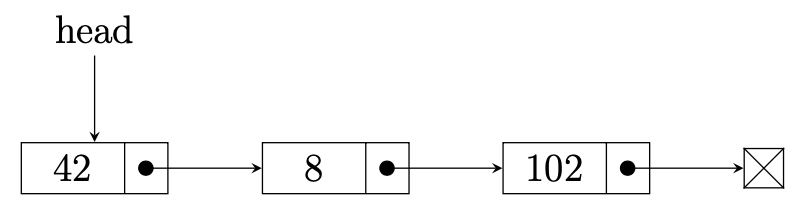

# Computer Science II
## Lab 7.0 - Linked Lists

An introduction linked list data structures.

This is a lab used in Computer Science II (CSCE 156, CSCE 156H) in the 
[Department of Computer Science & Engineering](https://cse.unl.edu) at the 
[University of Nebraska-Lincoln](https://unl.edu).

Chris Bourke wrote this lab, revamped by Sarah Roscoe for Summer 2021.

## Overview

### Resources

Prior to lab you should read/review the following resources.

1.  Review this laboratory handout prior to lab.

2.  Read the following wiki entry on linked lists:  
    <http://en.wikipedia.org/wiki/Linked_list>

### Lab Objectives & Topics

Following the lab, you should be able to:

-   Use Linked Lists to store/retrieve/manipulate large collections of
    objects

-   Implement Java interfaces

### Peer Programming Pair-Up

You may work on this lab with a partner or by yourself. Whichever you choose, you should submit your code to the corresponding Handin assignment. Handin link: https://cse-apps.unl.edu/handin

If you attend lab over Zoom, you may work in a a pair programming setup. At the start of each lab, you may be randomly paired up with another student by a lab instructor. One of you will be designated the driver and the other the navigator.

The navigator will be responsible for reading the instructions and telling the driver what is to be done. The driver will be in charge of the keyboard and workstation (on Zoom, this means the driver shares their screen). Both driver and navigator are responsible for suggesting fixes and solutions together. Neither the navigator nor the driver is "in charge." Beyond your immediate pairing, you are encouraged to help and interact and with other pairs in the lab.

Each week you should try to alternate: if you were a driver last week, be a navigator next, etc. Resolve any issues (you were both drivers last week) within your pair. Ask the lab instructor to resolve issues only when you cannot come to a consensus.

Because of the peer programming setup of labs, it is absolutely essential that you complete any pre-lab activities and familiarize yourself with the handouts prior to coming to lab. Failure to do so will negatively impact your ability to collaborate and work with others which may mean that you will not be able to complete the lab. 

## 1. Getting Started

Clone this project code for this lab from GitHub in Eclipse using the
URL: https://github.com/sroscoe2/CSCE156-Lab07.git. Refer to Lab 1.0 for
instructions on how to clone a project from GitHub.

## 2. Linked Lists

List ADTs provide functionality for dealing with collections of objects
in an object-oriented manner. In contrast to "static" arrays that have a
fixed size and require the client code to do the necessary "bookkeeping"
of the array, a List ADT provides an interface to dynamically add,
remove, and retrieve elements while abstracting (hiding) the details of
how it does it. In an array-based list, the list would internally resize
the array as necessary. In a linked list, elements are added by creating
nodes and manipulating references.

A linked list is typically implemented using nodes which contain
elements and a reference to a another node (the "next" node). In
general, a linked list maintains a reference only to a head node. 

Here's an example of a linked list with 3 nodes. The head references the 
first node while each node references the next node in the list, linking 
them all together. The last node's next reference is undefined (or null) 
or may point to a sentinel node value to indicate the end of the list.
<p align="center">

</p>  

In this lab, you will implement a linked list ADT that holds objects and
implements several standard methods. Your list implementation is used in
a larger inventory and truck management application, so you need to
thoroughly test your implementation before you run the full application.

## 3. Activities

### 3.1 Linked List Implementation

Most of the application code has been provided for you. The `Truck` and 
`TruckListNode` classes representing trucks and a single node holding a 
truck has been provided. You will need to finish the implementation of 
the class.

Specifically, you will first need to define the state of your list and
possibly a constructor. Then you will need to implement the following
methods.

-   `getSize()` - This method returns the number of elements in the list

-   `clear()` - This method will clear the entire list. After calling it, the list
    should be empty

-   `addToStart()` - This method should add the given truck to the front of the list

-   `addToEnd()` - This method should add the given truck to the end of the list

-   `remove()` - This method should remove the truck at the specified position,
    assuming the list is indexed starting at 0. This method should throw
    an `IndexOutOfBoundsException` if an invalid position is provided

-   `getTruck()` - This method should return the truck at the specified position,
    assuming the list is indexed starting at 0. This method should throw
    an `IndexOutOfBoundsException` if an invalid position is provided

-   `print()` - This method should print the list to the standard output in a
    human readable format (hint: make use of the `toString()` method).

You should look for opportunities where you can *reuse* the
functionality of some of these methods rather than reimplementing the
same algorithms.

### 3.2 Testing Your Implementation

To make sure that your implementation works, you should utilize the
utilities and other tools provided to design and write several test
cases. You will place these test cases into the `ListTester` class and make sure that
the results are as expected. You will need to write your own test cases.
As you write your test cases, keep the following in mind.

-   What are the "corner case(s)" that should be tested? A corner case
    is a pathological case that would occur only under special
    circumstances and may require special consideration.

-   Is it a good idea to test cases in which you know an exception will
    be thrown? Why or why not? How could you test them?

-   For this activity, a visual inspection suffices, but how might you
    automate such testing to eliminate human error in the process?

To help you write test cases, a few tools have been provided to you.

-   The `ListTester` class gives you an example of how to instantiate 
    and use your `TruckList` class

-   The `Truck` class has a static "factory" method that creates a 
    `Truck` instance with a random
    license plate that you can use in your test cases

-   The `Truck` class has a special idiom (software design pattern) built into
    it: the *builder pattern*. The more member fields that an object
    has, the more difficult it is to write consistent and readable code
    to call its various constructor(s). The builder pattern allows you
    to use a *fluent* style to build an object by calling "setters" on
    an inner-builder class prior to actually building the object.
    Objects that have a builder pattern are easier to use and construct.
    The `ListTester` class contains an example on how to use the builder pattern.

## 4. Testing, Submitting & Grading

* Test your programs using the provided JUnit test suite(s).  Fix any
errors and completely debug your programs.
* Submit the following files through webhandin:
  * `TruckList.java`
* Run the grader and verify the output to complete your lab.

## Advanced Activity (Optional) 

The linked list you have implemented is constructed of nodes which can
only contain instances of the `Truck` class. Modify the linked list to
accommodate any type using generics. In simple terms, a generic can be
thought of as a variable type. An example of a generic for an `ArrayList` is:

`List<MyType> listofMyType = new ArrayList<>();`

This statement constructs an `ArrayList` which only contains objects of 
`MyType`. You should rename your `TruckList` and `TruckListNode` to generic 
`MyList` and `MyListNode`. You then need to add a generic type to
the implementation of `MyList` and `MyListNode` as follows.

```java
class MyList<T> { 
  ... 
}

class MyListNode<T> { 
  ... 
}
```

The extra `<T>` at the end of these class definition indicates a generic type 
`T` will be used throughout each of these class definitions. When you need
to construct a type of in one such class you write:

```java
class MyListNode<T> {

  private T item;

}
```

The `T` generic is a placeholder for the type which a use specifies. In the
following code snippet a `MyListNode` is generated such that it can store objects of
`MyType`:

```java
MyListNode<MyType> listNode = new MyListNode<>();
```

In your implementation of `print()` simply print out the string representation of
the objects in your linked list using the `toString()` method of each object.


